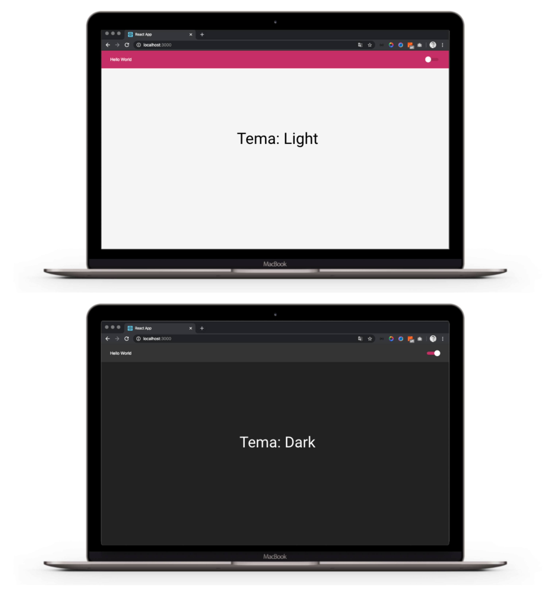

# 💡 Criando Temas com ReactJS e TypeScript

Esse projeto é um aprendizado em criar temas para sistemas usando o framework reactJS mais a linguaguem TypeScript. 
Usei o conceito de estado do React para manipular dinamicamente a mudança dos temas, e utilizado o localStorage, para persistir a escolha do tema por parte do usuário e para o browser não perder essas definições.

Script de criação: `create-react-app nomeDoProjeto --template=typescript`

## 📚 Dependencias do projeto

Para esse sistema foi usada as seguintes dependencias :

1. Desenvolvedor: @types/styled-components
2. styled-components
3. react-switch
4. polished

## 🎉 Executar este projeto

1. Instale as dependencias: `yarn install` ou `npm i`

2. Execute o projeto: `yarn start` ou `npm start`
